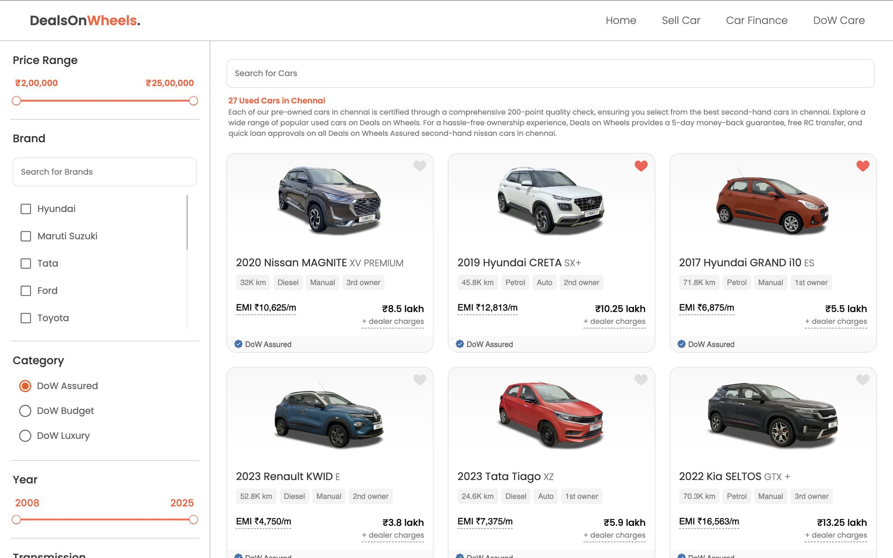
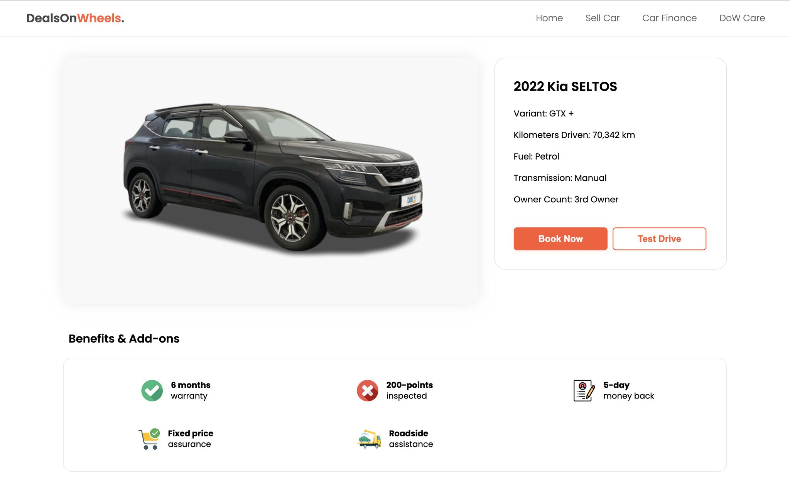
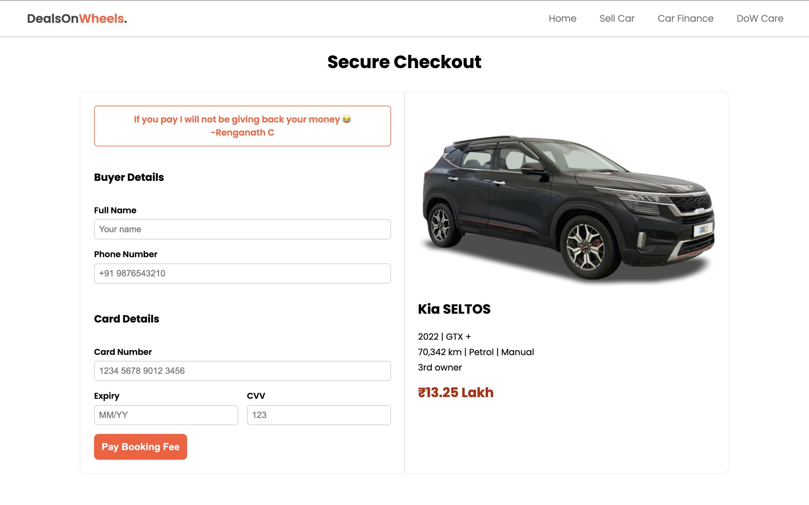
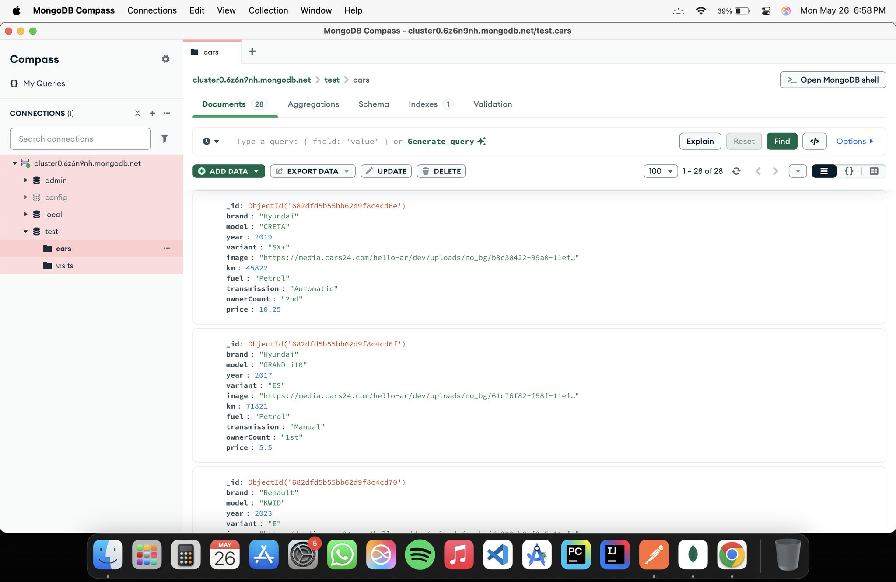

# Deals On Wheels — Used Car Resale Platform (MVP)

Deals On Wheels is a full-stack web application that simulates a modern used-car resale platform.
Users can browse used cars, apply filters, view detailed listings, and proceed through a
checkout-style flow via a clean, responsive UI.

This project was built as an **end-to-end MVP**, with emphasis on real-world backend structure,
REST APIs, and frontend–backend integration.

## 🔗 **Live Demo:**  
### https://dealsonwheels.vercel.app/

> ⚠️ The backend is hosted on a free plan and may take **~45 seconds** to spin up on first request.  
> If the page doesn’t load immediately, please refresh after a short wait.  
>  
> Recommended to view on laptop/desktop (mobile not optimized yet).

---

## ✨ Features

- 🚘 Browse used cars with detailed specifications
- 🎛️ Multi-parameter filtering
- 📄 Dedicated vehicle detail pages
- 🛒 Checkout-style booking flow
- 🔗 RESTful backend with MongoDB
- 📦 Clear separation of frontend and backend

---

## 🧱 Tech Stack

### Frontend
- React (Vite)
- React Router
- Firebase Authentication (email/password)

### Backend
- Node.js
- Express.js
- RESTful API design

### Database
- MongoDB (Mongoose)

### Tools
- Postman

---

## 🔐 Authentication Note (Design Choice)

Firebase email/password authentication with auth-based routing is already implemented
in the frontend. For this MVP, authentication is intentionally bypassed to allow
**public browsing of the marketplace**.

The app supports two entry components:

- `Home`  → Auth-enabled entry (login/signup → dashboard)
- `Home1` → Public entry (direct redirect to marketplace)

### Current MVP Behavior
```jsx
<Route path="/" element={<Home1 />} />
```

### Enable Authentication
```jsx
<Route path="/" element={<Home />} />
```

Authentication will be fully enabled once seller-side flows and payment integration
are introduced.

---

## ⚠️ Development Port Note (macOS)

On macOS, port `5000` may be occupied by system-level services
(Control Center / AirPlay Receiver). When this happens, requests to
`localhost:5000` can return `403 Forbidden` without ever reaching the backend.

For local development, the backend is configured to run on a different port
(e.g. `5002` or `5003`) via environment variables.

---

## 📸 Screenshots & API Preview

- Home page with car listings and filters
  <p align="center"></p>
- Vehicle Listing page
  <p align="center"></p>
- Checkout page
  <p align="center"></p>
- API POST endpoint to add cars to DB (Shown in Postman)
  <p align="center"></p>
- API GET endpoint to fetch cars from DB (Shown in Postman)
  <p align="center"></p>
- MongoDB collection storing car data
  <p align="center"></p>

---

## 📘 Backend Documentation

The backend for Deals On Wheels is maintained as a separate repository.
For detailed API documentation, schema definitions, and backend-specific
setup instructions, please refer to the backend repository:

## https://github.com/renganathc/deals-on-wheels-backend

---

## 🗂 Repository Structure

This project uses a **parent (meta) repository** with Git submodules.

- `/` → (Frontend in root) React + Vite application  
- `/backend`  → Node.js + Express backend repository  

---

## 🛠️ Local Setup

```bash
# Clone meta repo
git clone https://github.com/your-username/deals-on-wheels.git
cd deals-on-wheels

# Initialize submodules
git submodule update --init --recursive

# Backend
cd backend
npm install
npm run dev

# Frontend (separate terminal)
npm install
npm run dev
```

> Backend configuration is managed via `.env`.

---

## 🔮 Planned Enhancements

- 🧑‍💼 Seller onboarding and listings
- 💳 Real payment integration
- 📱 Mobile responsiveness

---

## 📬 Feedback

This project is still evolving. Feedback, suggestions, and discussions are welcome.
Feel free to open an issue or reach out.
